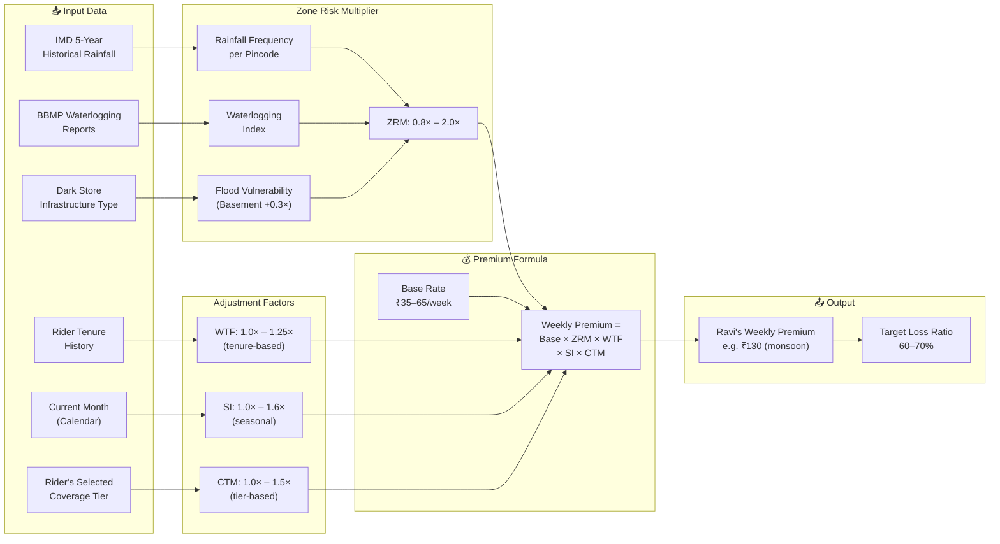
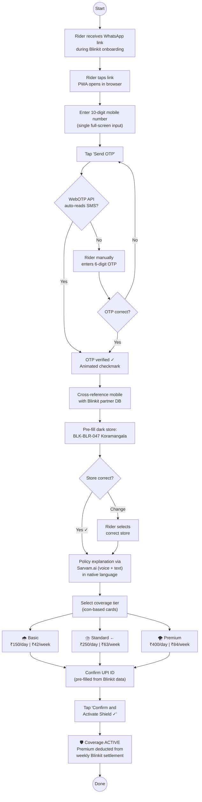
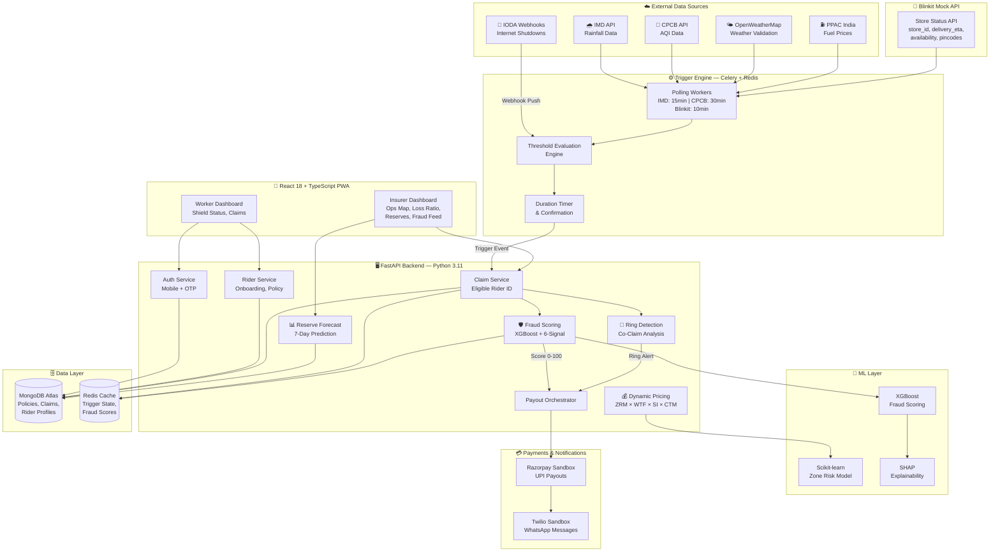
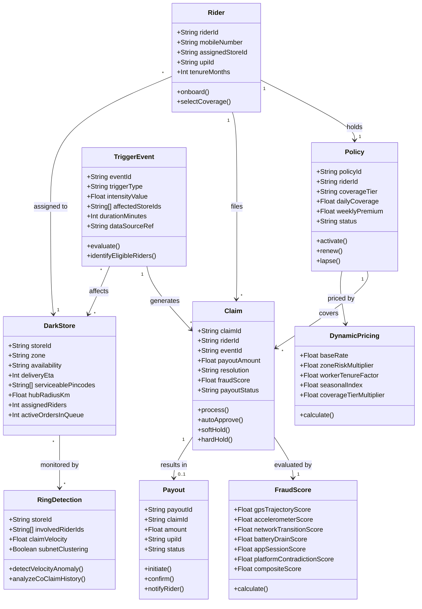
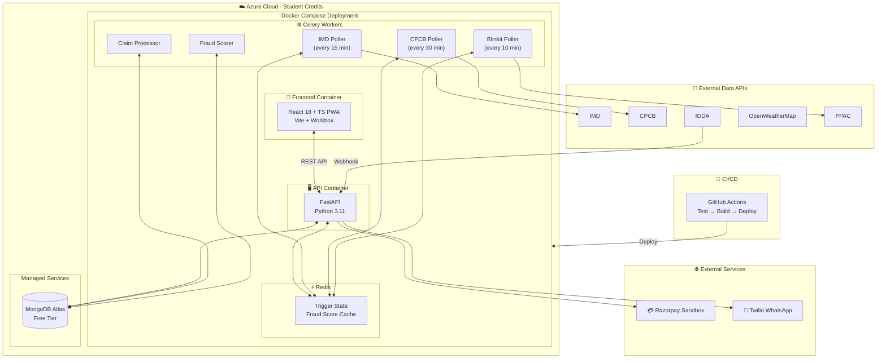

# ShieldRide 🛡️

### AI-Powered Parametric Income Protection for Blinkit Delivery Partners

**Guidewire DEVTrails 2026 — Unicorn Chase | Seed Phase Submission**

> *Team Autolearn · Amrita Vishwa Vidyapeetham, Bengaluru*

***

> "When it rains in Koramangala, Ravi loses ₹700.
> ShieldRide ensures that loss is covered before he even checks his phone."

***

## Index

1. [Sector Selection — Why Q-Commerce](#1-sector-selection)
2. [Persona Selection — Why Blinkit and Who Is Ravi](#2-persona-selection)
3. [Platform Decision — PWA over Native App](#3-platform-decision)
4. [Parametric Triggers — Selected and Why](#4-parametric-triggers-selected)
5. [Parametric Triggers — Excluded and Why](#5-parametric-triggers-excluded)
6. [Dynamic Pricing Model — Formula, Logic, and Ravi's Story](#6-dynamic-pricing-model)
7. [Onboarding Process — 90 Seconds, Zero Documents](#7-onboarding-process)
8. [Zero-Touch Claim Execution](#8-zero-touch-claim-execution)
9. [Analytics Dashboard — Forward-Looking Insurer Intelligence](#9-analytics-dashboards)
10. [Tech Stack & Architecture](#10-tech-stack--architecture)
11. [Six-Week Roadmap](#11-six-week-roadmap)
12. [Regulatory & Compliance](#12-regulatory--compliance)
13. [Out of Scope (By Design)](#13-out-of-scope-by-design)
14. [Team](#14-the-team)
15. [Adversarial Defense — Fraud Detection and Market Crash Response](#15-adversarial-defense--fraud-detection-and-market-crash-response)

***

## 1. Sector Selection


**Selected Sector: Q-Commerce (Quick Commerce) — Grocery and Essential Delivery**

### The Real-World Event That Validated This Choice

On December 31, 2025, over 2,00,000 delivery workers across Zomato, Blinkit, Swiggy, and Amazon staged a nationwide flash strike. Their demand was not a salary hike — it was a safety net for the days they simply cannot work, not because they chose not to, but because it rained too hard, the air became unbreathable, or the platform they depended on went dark.

That strike is the real-world proof statement for ShieldRide.

India's gig workforce stands at 12 million workers today and is projected to cross 24 million by the end of this decade. The Q-Commerce segment alone — Blinkit, Zepto, Swiggy Instamart — is expanding at 40%+ year-on-year, with Blinkit targeting 3,000 dark stores by March 2027. Yet despite Zomato and Blinkit spending over ₹100 crore on insurance coverage for delivery partners in 2025, that coverage addresses health, life, and accidents — not income loss.

The Sabka Bima, Sabki Raksha Bill 2025 — India's most significant insurance reform legislation — explicitly promotes parametric and micro-insurance for informal and gig workers as a national priority. The regulatory window is open. The market need is documented at the highest levels of government. The product does not exist yet.


**ShieldRide focuses on Q-Commerce because it is the segment where parametric income protection is most urgently needed, most technically feasible, and most commercially viable.**

### Why Q-Commerce Beats Every Other Sector

| Factor | Food Delivery (Zomato/Swiggy) | E-Commerce (Amazon/Flipkart) | Q-Commerce (Blinkit) ✓ |
|---|---|---|---|
| Delivery window | 30–45 mins | Same day / next day | 10 min (hyperurgent) |
| Operational radius | 5–8km city scatter | City-wide | **1.5–3km dark store anchor** |
| Weather sensitivity | High | Low–Medium | **Extreme — total income stop** |
| Geofencing precision | Zone-level (noisy) | Broad (unusable) | **Street-level (surgical)** |
| Fraud verifiability | Difficult | Very difficult | **High — store_id as anchor** |
| Platform data structure | No consistent schema | Fragmented | **Documented JSON schema** |
| Teams likely choosing | ~60% | ~25% | **~10–15% (our edge)** |

Food delivery riders scatter across 30+ restaurants per city — parametric triggers cannot be applied with street-level precision. E-commerce riders operate city-wide — geofencing becomes meaningless. Q-Commerce riders are anchored to a single dark store with a documented 1.5–3km service radius.
That anchor is what makes parametric insurance mathematically defensible at the granularity insurers require.

***

## 2. Persona Selection

**Selected Platform: Blinkit (Zomato Quick Commerce)**

### Why Blinkit Over Zepto

Blinkit is chosen as the launch platform because its parent Zomato is publicly listed, its store data schema is documented, and Bengaluru has one of the highest densities of Blinkit dark stores. Fields like `store_id`, `delivery_eta`, `availability`, and `serviceable_pincodes` make it possible to simulate a realistic partner API and to cross-check fraud signals in real time.

| Technical Factor | Zepto | Blinkit ✓ |
|---|---|---|
| Parent company | Private (no public data) | Zomato — publicly listed, auditable |
| Store data schema | No documented public schema | `store_id`, `delivery_eta`, `availability`, `serviceable_pincodes` |
| Dark store count 2026 | ~700 stores | **2,000+ stores, targeting 3,000 by 2027** |
| Bengaluru coverage | Limited | **300+ stores — highest density city** |
| Fraud cross-validation | Not possible without internal access | **`delivery_eta` enables live platform contradiction check** |
| Mock API buildability | Schema must be entirely invented | **Schema mirrors real documented structure exactly** |
| Embedded insurance potential | Unknown payment rails | **Zomato weekly settlement — embedded deduction possible** |

### Meet Ravi - Our Persona in Depth

- Name: Ravi Kumar, 24
- Location: Bengaluru, Karnataka
- Dark store: BLK-BLR-047, Koramangala 4th Block
- Service radius: 2.1 km, pincodes 560034 and 560095
- Device: Low-end Android (Redmi Note 12)
- Connectivity: Airtel 4G, drops to 3G/2G in dense zones
- Earnings: ~₹21,000 per month in a good month
- Family remittance: ₹8,000 per month
- Existing insurance: None

Ravi manages his entire financial life via UPI on his phone, is not comfortable with English-heavy forms, and rarely checks email. On a normal day he earns about ₹700-₹750 across 12-14 hours of work; on disruption days (heavy rain, extreme AQI, platform downtime) his income can collapse to ₹140 or less.

***

### Ravi's Daily Workflow — Normal Day

```
07:30  Ravi logs into Blinkit Partner App at home
07:45  Rides to Dark Store BLK-BLR-047, Koramangala
08:00  First order accepted — 1.6km delivery, completed in 8 minutes
08:15  Second order queued immediately
       Running at 5–6 deliveries per hour during morning peak
13:00  Afternoon lull — 2 orders per hour average
17:00  Evening peak begins — back to 5–6 deliveries per hour
20:30  Final order completed
21:00  Signs off. Total earned today: ₹740
```

---

### Ravi's Disruption Day — Before ShieldRide

```
07:30  Ravi logs in. Sky looks dark.
08:45  Rainfall hits 28mm/hr. Orders stop appearing.
09:00  Ravi waits at dark store. App shows 0 available orders in zone.
09:30  Still raining. Still 0 orders.
11:30  Rain slows. 2 deliveries trickle in.
21:00  Signs off. Total earned: ₹140.
       Income lost to disruption: ₹600.
       Claims filed: 0. Recourse available: None.
```

---

### Ravi's Disruption Day — With ShieldRide

```
08:47  IMD API detects 28mm/hr rainfall sustained in pincode 560034
08:47  ShieldRide identifies dark stores serving pincode 560034
       → BLK-BLR-047 confirmed within affected zone ✓
08:48  System cross-checks Ravi's status
       → GPS within 180m of store at 08:30 ✓
       → Blinkit Partner App session active at 08:25 ✓
       → Store availability: "Closed" confirmed ✓
08:48  Fraud Confidence Score calculated: 14 / 100
       → Threshold <40: AUTO-APPROVE triggered
08:49  ₹180 UPI credit initiated via payment gateway
08:49  WhatsApp notification delivered to Ravi:

       "ShieldRide 🛡️: Heavy rain detected in Koramangala.
        Your income protection of ₹180 has been credited
        to your UPI account. No action needed from you.
        Stay safe and dry. — Team ShieldRide"

Ravi did nothing. His protection activated automatically.
The entire pipeline ran in 97 seconds.
```

## Product in One Line

> **ShieldRide is an AI-powered parametric income protection layer for Blinkit delivery partners, auto-paying riders within 2 minutes whenever weather, air, network, or platform events make them unable to work - with zero claim forms and zero English literacy required.**

ShieldRide turns objective, independently verifiable external data (IMD, CPCB, IODA, Blinkit APIs, PPAC) into automatic micro-payouts that replace Ravi's daily earnings on days he cannot work.

***

## 3. Platform Decision

**Selected: Progressive Web App (PWA)**
**Rejected: Native Android Application**

### Decision Framework

| Criteria | Native App | PWA — Selected ✓ |
|---|---|---|
| Installation friction | Play Store, 80–150MB download | Browser install, zero download size |
| Offline capability | Requires complex native implementation | Built-in via Service Worker caching |
| 2G/3G performance | Heavy assets, slow load | Lightweight, optimized for slow networks |
| Onboarding time | 3–5 minutes with OS permissions | **Under 90 seconds — OTP only** |
| Language support | Separate locale builds | Single codebase, runtime locale switching |
| Auto-updates | User must manually update | Silent background updates |
| Development speed | Parallel Android + iOS builds | **Single React codebase — faster Phase 2/3 delivery** |
| Device compatibility | Android 8+ required | Works on any browser, any Android version |
| Cost to user | Data cost of large download | Near-zero data cost |

### Benchmark

Blinkit's own partner onboarding currently takes 12–18 minutes with document uploads, selfie verification, and vehicle registration submission. We are targeting under 90 seconds with zero document friction — a 10x improvement using mobile number + OTP only, with an icon-first UI that requires no English literacy to navigate.

### Why This Matters for Ravi

Ravi will not download an insurance app. He downloads apps for navigation, payments, and Blinkit only. A PWA that installs via a single tap from a WhatsApp link — which he receives during his Blinkit onboarding — removes every adoption barrier without asking him to change his behavior.

***

## 4. Parametric Triggers (Selected)

### Design Principles

Every trigger follows three non-negotiable parametric principles informed by past failures such as the Nagaland parametric insurance case, where premiums were collected but payouts never fired because thresholds were misaligned with ground reality:

1. **Independently monitorable** - sourced from credible third-party data or platform telemetry, never self-reported by riders.
2. **Fortuitous** - entirely outside the worker's control.
3. **Causally direct** - a clear line from trigger event to income loss.

Binary triggers are rejected: partial disruptions receive partial payouts proportional to expected income impact.

### Trigger 1 - Extreme Rainfall

- Threshold: Rainfall intensity above 20 mm/hr for at least 60 minutes.
- Data sources: IMD API (primary), OpenWeatherMap (secondary validation).
- Geofencing: Pincode-level, aligned to each dark store's `serviceable_pincodes`.

**Why 20mm/hr:** IMD formally classifies 20mm/hr as the threshold of Very Heavy Rainfall, the point at which surface transport for two-wheelers becomes operationally unsafe. This is India's national meteorological standard, not an arbitrary number. Any insurance dispute involving this trigger references an independently published government classification.

**Why duration matters:** 20mm/hr for 5 minutes is a passing shower. 20mm/hr for 60 minutes is a flood event. Our trigger requires sustained intensity to prevent micro-showers from triggering claims during brief pauses in delivery activity.

**Tiered Payout:**

| Rainfall | Duration | Est. Income Impact | Payout |
|---|---|---|---|
| 20–30mm/hr | 1 hour | 30% daily loss | 30% of daily coverage (≈₹60–90) |
| 30–50mm/hr | 2 hours | 60% daily loss | 60% of daily coverage (≈₹120–180) |
| >50mm/hr | 3+ hours | 100% daily loss | 100% daily coverage (≈₹200–260) |

**Basis Risk Mitigation:** Worker GPS must confirm presence within 300m of assigned dark store at trigger time. Workers outside the zone at time of trigger are excluded from that claim event — preventing payouts for workers who were unaffected by the localized rainfall.

### Trigger 2 - Extreme Heat Index

- Threshold: Heat index above 44°C for more than 2 hours.
- Data source: IMD temperature and humidity readings to compute WBGT heat index.
- Rationale: IMD's Severe Heat Wave warnings and ongoing J-PAL pilots for heat-triggered parametric cover for Indian delivery workers.

**Why 44°C heat index and not air temperature alone:** Humid heat is more dangerous than dry heat at the same temperature. The Wet Bulb Globe Temperature(WBGT) heat index factors in both temperature and humidity — the combination that determines real physiological stress on an outdoor worker. IMD issues Severe Heat Wave warnings at this threshold. Outdoor physical labor on a two-wheeler for sustained periods at >44°C WBGT constitutes genuine inability-to-work, not mere discomfort.

**Why this trigger is uniquely powerful for Blinkit vs. Zomato:** A Zomato rider waits inside air-conditioned restaurants between pickups. A Blinkit rider has no such refuge — their dark store is a warehouse with no cooling infrastructure. The exposure is total and continuous.

**J-PAL Research Validation:** The Abdul Latif Jameel Poverty Action Lab (J-PAL) is currently piloting parametric insurance for Indian delivery workers specifically triggered by heat stress events, validating this as a live research-backed use case.

**Tiered Payout:**

| Heat Index | Duration | Payout |
|---|---|---|
| 44–47°C | 2 hours | 40% daily coverage |
| 47–50°C | 2 hours | 70% daily coverage |
| >50°C | Any duration | 100% daily coverage |

### Trigger 3 - Severe AQI

- Threshold: AQI above 400 for at least 4 hours.
- Data source: CPCB India real-time API - the legally authoritative metric for Indian air quality.
- Rationale: CPCB's "Severe" category explicitly advises that all outdoor physical activity should be avoided.

**Why CPCB over any commercial AQI source:** In any Indian insurance dispute resolution, CPCB is the government-recognized standard for air quality measurement. A commercial API can be challenged in arbitration. CPCB data cannot — it is the statutory authority. Using CPCB eliminates an entire category of legal vulnerability that teams using third-party AQI APIs will not have considered.

**Why AQI >400 specifically:** CPCB's Severe AQI category (400–500) carries an explicit health advisory stating outdoor physical activity must be avoided entirely for all population groups. At this level, sustained exertion on a two-wheeler for delivery work creates a direct causal chain from air quality event to income loss — exactly the causal directness parametric insurance requires.

**Tiered Payout:**

| AQI Level | Duration | Payout |
|---|---|---|
| 400–450 | 4 hours | 40% daily coverage |
| 450–500 | 4 hours | 70% daily coverage |
| >500 | Any duration | 100% daily coverage |

**Blinkit-Specific Context:** Blinkit's dark store expansion in Delhi NCR was directly impacted by high AQI events in January 2026, with operational disruptions reported across multiple zones. This is a documented, current platform-specific risk — not a theoretical one.

### Trigger 4 - Platform Hub Downtime

- Threshold: `availability: "Closed"` or `delivery_eta: null` for more than 60 consecutive minutes between 10:00 and 22:00.
- Data source: A Blinkit-style store-status API mirroring real documented schema.
- Scope: Store-level - each dark store is treated as a separate risk unit.

**Mock API Response Structure:**
```json
{
  "store_id": "BLK-BLR-047",
  "zone": "Koramangala_4thBlock",
  "availability": "Closed",
  "delivery_eta": null,
  "serviceable_pincodes": ["560034", "560095"],
  "hub_radius_km": 2.1,
  "assigned_riders": 12,
  "active_orders_in_queue": 0,
  "last_updated": "2026-03-19T14:30:00IST"
}
```

**Production Integration Note:** In production this integrates with Blinkit's partner operations API or infers status via real-time scraping of their store availability endpoints. The mock schema mirrors Blinkit's documented data structure precisely — including the `active_orders_in_queue` field which is critical for fraud detection cross-validation in Trigger 4.

**Why this trigger is uniquely powerful:** Platform downtime is the only trigger that is 100% within the platform's operational domain and entirely unrelated to weather. It covers Ravi on a perfect sunny day when the platform itself fails him. No weather-only parametric insurance product covers this scenario. ShieldRide does.

**Why 60 minutes and not 30:** Brief platform maintenance windows of 15–30 minutes are common and do not materially affect daily income. A 60-minute confirmed outage during peak hours represents a verifiable income disruption of 5–8 delivery slots — a meaningful and claimable loss.

### Trigger 5 - Localized Internet Shutdown

- Threshold: Mobile data suspension at district level for more than 3 hours.
- Data source: IODA (CAIDA, UC San Diego) real-time internet disruption monitoring.
- Rationale: India has frequent telecom shutdowns during unrest; when data dies, riders cannot accept, navigate, or confirm orders.

**Why IODA:** IODA is a free, operationally maintained API by CAIDA at UC San Diego that tracks internet disruptions globally including Indian telecom shutdowns in near real-time at the district level. India recorded 84 internet shutdowns in 2024 alone — many government-imposed, many during civil unrest events. When mobile data is suspended in a delivery zone, Ravi cannot accept orders, navigate to customers, or confirm deliveries. The income loss is total and immediate. IODA provides the only reliable third-party data oracle for this trigger category.

**Why 3 hours and not 1:** Short network disruptions of under an hour resolve before materially affecting a rider's daily earnings. A 3-hour confirmed shutdown during peak hours represents loss of approximately 15–18 delivery
slots — a material and verifiable income disruption.

**Tiered Payout:**

| Duration | Payout |
|---|---|
| 3–5 hours | 50% daily coverage |
| 5–8 hours | 80% daily coverage |
| >8 hours | 100% daily coverage |

### Trigger 6 - Economic Triggers (Net Effective Income Protection)

ShieldRide includes two economic triggers that go beyond weather and infrastructure to protect Ravi's net income from platform-side decisions.

**Trigger 6A - Fuel Price Surge**

- Threshold: Petrol price increase exceeding 15 percent within any rolling 7-day window.
- Data source: PPAC India daily price data.
- Legal framing: Protected as a "Net Effective Income" event rather than reimbursed expense, to align with IRDAI micro-insurance rules.

**Critical Legal Framing:** Under IRDAI micro-insurance regulations, coverage must apply to income loss, not expense increases. We frame this trigger as a Net Effective Income event: when fuel costs surge >15% in 7 days, a Blinkit rider's net effective hourly income after fuel deductions drops below the minimum viable earning threshold of ₹80/hour. At this point the disruption constitutes effective income loss — not merely increased expenses — and activates the parametric payout. This framing is legally sound under IRDAI definitions.

**Trigger 6B - Platform Incentive Collapse**

- Threshold: Rider's daily incentive payout falls more than 50 percent below their 30-day rolling average.
- Data source: ShieldRide's own earnings history for the rider (with consent).
- Rationale: Blinkit incentives often represent 30-40 percent of riders' weekly income, so sudden cuts are real income shocks.

**Why this trigger is genuinely novel:** Blinkit riders depend on surge incentives and daily bonuses for 30–40% of total income in any given week. A sudden platform-side decision to drop incentives by 50% below the rolling average is a real income loss event caused by an entirely external, uncontrollable platform decision. No existing insurance product covers this. ShieldRide is the first to frame it as an insurable parametric event. This directly positions ShieldRide as covering platform-side income risk — a category unique in the entire InsurTech landscape.

***

## 5. Parametric Triggers (Excluded)

**This section documents what ShieldRide explicitly chose NOT to build and why.**

We evaluated every commonly proposed parametric trigger for gig worker insurance and rejected the following. This is not an omission — it is a deliberate product judgment demonstrating that we evaluated what genuinely helps our specific hyper-local persona rather than building generic features.

### Excluded: Traffic API Integration

**Reason for exclusion — Three-part argument:**

**Part 1 — Operational radius makes traffic irrelevant.**
Blinkit riders operate within a 1.5–2.5km dark store radius. At this distance, riders navigate bylanes, housing society access roads, and pedestrian paths — not arterial roads where traffic congestion is measured. Traffic APIs measure congestion on highways and major roads. Our persona does not use them.

**Part 2 — Platform policy change eliminated the basis.**
Blinkit dropped its 10-minute delivery commitment in January 2026 following government pressure and the December 2025 gig worker strike. Delivery time is no longer the primary income determinant — order volume and zone availability are. A traffic delay trigger tied to delivery time performance is no longer causally relevant.

**Part 3 — Data resolution is insufficient.**
Traffic APIs provide city-aggregate or road-segment data. They cannot resolve to the 2km pincode level of a dark store service area. The data granularity required to make a traffic trigger meaningful for our persona simply does not exist in any available API.

**Verdict:** Traffic API integration would add engineering complexity, consume development time, and produce a trigger that does not causally connect to income loss for our chosen persona. It is excluded.

### Excluded: Vehicle Repair Coverage

**Reason:** Explicitly prohibited by the DEVTrails 2026 use case specification. ShieldRide covers income loss only. Vehicle repair is an asset protection product — a fundamentally different insurance category requiring different actuarial modeling, different regulatory approvals, and different claims assessment infrastructure.

### Excluded: Health and Accident Coverage

**Reason:** Explicitly prohibited by the DEVTrails 2026 use case specification. Additionally, Blinkit (via Zomato) already provides accident insurance coverage for delivery partners as a platform benefit. Building a competing health product would duplicate existing coverage rather than filling the actual gap — which is income protection on disruption days.

### Excluded: Flood Mapping API (as a standalone trigger)

**Reason:** Flood severity is already captured more precisely and causally through our Rainfall Intensity trigger combined with dark store basement-status risk multiplier. A separate flood mapping trigger would create trigger overlap and potential double-payout scenarios. Our rainfall trigger with duration thresholds captures the same events with more granular payout calibration and no overlap risk.

***

## 6. Dynamic Pricing Model

### Pricing Data Flow



### The Core Formula

ShieldRide prices weekly premiums using a multiplicative model:

```text
Weekly Premium = Base Rate
                 × Zone Risk Multiplier (ZRM)
                 × Worker Tenure Factor (WTF)
                 × Seasonal Index (SI)
                 × Coverage Tier Multiplier (CTM)
```

**Sustainability Target: Loss Ratio of 60–70%**
Industry benchmark for viable micro-insurance products.
- Loss Ratio <40%: Overcharging workers — ethically indefensible
- Loss Ratio 60–70%: Sustainable, industry-standard band
- Loss Ratio >90%: Product financially unviable — cannot sustain claims

### Components

**Base Rate: ₹35–65 per week** 
The base rate represents the minimum premium for a worker in a median-risk zone with no tenure history. Calibrated to produce a 65% loss ratio at median claim frequency derived from 5-year IMD historical disruption data for Bengaluru.

**Zone Risk Multiplier (0.8×-2.0×)** 
Trained on:
- 5 years of IMD historical rainfall frequency data per Area's pincode
- Municipal Corporation waterlogging incident reports
  — publicly available, hyperlocal BBMP government data
- Dark store physical infrastructure: basement stores carry an additional
  0.3× loading due to flood vulnerability relative to ground-floor stores

| Zone / Dark Store | Risk Profile | ZRM |
|---|---|---|
| Whitefield (BLK-BLR-089) | Low rainfall, elevated terrain | 0.8× |
| Indiranagar (BLK-BLR-033) | Moderate, good drainage | 1.0× |
| Koramangala 4th Block (BLK-BLR-047) | High — storm drain proximity | 1.3× |
| Bellandur (BLK-BLR-061) | Very high — lake overflow zone | 1.7× |
| Basement store — any zone | Physical flood vulnerability | +0.3× |

**Why Municipal Corporation data specifically:** Municipal  publishes waterlogging complaint data and flood incident maps at the ward level. This is hyperlocal government data that directly validates zone risk scores at a granularity no national dataset can match.

**Worker Tenure Factor (WTF): 1.0× to 1.25×**
| Tenure | Factor | Rationale |
|---|---|---|
| 0–4 weeks | 1.25× | Unknown risk profile — standard actuarial loading |
| 1–3 months | 1.15× | Limited history — moderate loading |
| 3–6 months | 1.05× | Emerging history — light loading |
| >6 months | 1.0× | Established risk profile — base rate |

This mirrors standard actuarial practice for new risk profiles — identical to how motor insurance treats new drivers with no claims history. Ravi at 14 months tenure qualifies for 1.0× — base rate.

**Seasonal Index (SI): 1.0× to 1.6×**
| Period | Index | Basis |
|---|---|---|
| Jan–Feb (winter) | 1.0× | Minimal disruption risk |
| Mar–May (pre-monsoon heat) | 1.2× | Heat wave and AQI season begins |
| Jun–Sep (monsoon) | 1.6× | Peak rainfall, flood risk |
| Oct–Nov (post-monsoon) | 1.3× | Residual flooding, fog begins |
| Dec (winter fog) | 1.1× | Morning fog affecting visibility |

Derived from 5-year IMD historical claim frequency data per month for
Bengaluru — not an estimate but a data-calibrated seasonal adjustment.

**Coverage Tier Multiplier (CTM): 1.0× to 1.5×**
Workers choose a coverage tier at onboarding:
| Tier | Daily Coverage | Weekly Premium (Ravi — KOM zone, monsoon) | CTM |
|---|---|---|---|
| Basic | ₹150/day | ₹42 | 1.0× |
| Standard | ₹250/day | ₹63 | 1.25× |
| Premium | ₹400/day | ₹84 | 1.5× |

### Ravi's Weekly Premium — Worked Example

Ravi works from BLK-BLR-047, Koramangala. Ground floor store. 14 months tenure.
It is July — peak monsoon. He chooses Standard coverage (₹250/day).

```
Base Rate          = ₹50
Zone Risk          = ₹50 × 1.3  = ₹65.00   (Koramangala — storm drain risk)
Tenure Factor      = ₹65 × 1.0  = ₹65.00   (>6 months — established profile)
Seasonal Index     = ₹65 × 1.6  = ₹104.00  (July — peak monsoon)
Coverage Tier      = ₹104 × 1.25 = ₹130.00 (Standard tier)

Ravi's Weekly Premium = ₹130
Daily coverage if trigger fires = ₹250
```

Ravi earns approximately ₹5,040 per week (₹720/day × 7). His weekly premium of ₹130 represents 2.6% of weekly earnings — comparable to the provident fund contribution rate for formal employees. The product is priced to feel negligible relative to income while remaining actuarially sustainable.

### Premium Deduction — Embedded Insurance Architecture
In production, Ravi's ₹130 weekly premium is deducted automatically from his Blinkit weekly settlement payout every Friday — before he receives the net amount. He never sees the deduction as a separate payment. This embedded insurance distribution model is the only mechanism that makes micro-insurance viable at scale for workers who have no habit of paying insurance premiums voluntarily. The coverage period begins Monday and covers the full 7 days ahead — forward coverage, not retrospective reimbursement.

***

## 7. Onboarding Process

**Target: Under 90 seconds. Zero documents. Zero English literacy required.**

### The Onboarding Philosophy

Ravi will not fill a form. He will not upload an Aadhaar. He will not verify an email. He has done none of these things for any financial product he currently uses — he pays rent via UPI, receives salary via UPI, sends money home via PhonePe. His entire financial life runs through a mobile number and a 6-digit PIN.

ShieldRide's onboarding is built around the same pattern.

### The 90-Second Onboarding Flow

**Step 1 — Entry Point (0–10 seconds)**
Ravi receives a WhatsApp message from ShieldRide during his Blinkit
partner onboarding:
```
"ShieldRide 🛡️: Protect your income on bad weather days.
 Tap to set up in 60 seconds — no documents needed.
 [LINK]"
```
He taps the link. The PWA opens instantly in his browser — no Play Store, no download. A single screen appears with one icon: a shield with the text "Protect Your Earnings" in Kannada.

**Step 2 — Mobile Number Entry (10–25 seconds)**
Single full-screen input field. Large numeric keyboard appears automatically. Ravi enters his 10-digit mobile number — the same one registered with Blinkit. 
One tap: "Send OTP."

No name field. No email field. No password field.

**Step 3 — OTP Verification (25–35 seconds)**

6-digit OTP auto-reads from SMS via WebOTP API on Android — Ravi does not manually type it. Screen shows a single animated checkmark on success.

**Step 4 — Dark Store Confirmation (35-45 seconds)** - ShieldRide cross-references Ravi's mobile number against the Blinkit partner database (mock integration) and pre-fills his assigned dark store:
```
[Store Icon] Your Blinkit Hub:
Koramangala 4th Block
BLK-BLR-047

Is this correct?
[YES ✓]    [CHANGE]
```
One tap confirmation. No typing required.

**Step 5 — Policy (45–60 seconds)** 
API keys from providers such as Sarvam.ai will be used to explain our policies, terms and conditions to users in their native languages, delivering the information through both voice and text.
This approach ensures a smooth and accessible onboarding experience, especially for users who may have limited education.

**Step 6 — Coverage Tier Selection (60–80 seconds)** 
Three large icon-based cards — no paragraphs of insurance text:

```
🌧️ Basic       ₹150/day protected    ₹42/week
⛈️ Standard    ₹250/day protected    ₹63/week  ← Recommended
🌪️ Premium     ₹400/day protected    ₹84/week
```
(These costs are for a safe region; they may vary as per risk factors)
Ravi taps Standard. One tap.

**Step 7 — UPI Confirmation (80–90 seconds)**  
```
Weekly premium of ₹63 will be automatically
deducted from your Blinkit weekly payment every Friday.

Your UPI: ravi.kumar@paytm  ← pre-filled from Blinkit data

[Confirm and Activate Shield ✓]
```

One tap. Coverage active.

Total time elapsed: 87 seconds.
Total fields manually typed by Ravi: His 10-digit mobile number.
Documents uploaded: Zero.
English text read: Zero — full regional language UI.

### Onboarding UX Principles

| Principle | Implementation |
|---|---|
| One action per screen | Never more than one decision point at a time |
| Icon-first language | Every concept represented visually before text |
| Pre-fill everything possible | Dark store, UPI ID pulled from Blinkit partner data |
| Auto-read OTP | WebOTP API eliminates manual OTP entry on Android |
| No jargon | "Apni Kamai Bachao" not "Parametric Income Protection Policy" |
| Regional language support | Phase 2 deliverable — UI localised for Kannada-speaking riders |
| Offline resilience | PWA caches onboarding flow — works on 2G without page reload |

### Onboarding Flow Diagram



***

## 8. Zero-Touch Claim Execution

### The Promise

In ShieldRide, **the event is the claim**: riders should receive money without needing to understand or operate traditional insurance workflows.

### Claim Flow — Sequence Diagram

```mermaid
sequenceDiagram
    autonumber
    participant IMD as 🌧️ IMD API
    participant TE as ⚙️ Trigger Engine
    participant DB as 🗄️ MongoDB
    participant CS as Claim Service
    participant FS as 🛡️ Fraud Scorer
    participant RD as 🔗 Ring Detector
    participant PO as Payout Orchestrator
    participant RP as 💳 Razorpay
    participant TW as 📱 Twilio WhatsApp
    participant Ravi as 🏍️ Ravi

    Note over IMD,Ravi: ⏱️ Target: Trigger → Payout in under 120 seconds

    rect rgb(15, 52, 96)
        Note right of IMD: TRIGGER DETECTION
        IMD->>TE: Rainfall 28mm/hr in pincode 560034
        TE->>TE: Start duration timer
        TE->>TE: 60 min sustained → threshold confirmed
        TE->>DB: Log TriggerEvent
    end

    rect rgb(26, 26, 46)
        Note right of TE: ELIGIBLE RIDER IDENTIFICATION
        TE->>CS: TriggerEvent confirmed for BLK-BLR-047
        CS->>DB: Query riders assigned to affected store_ids
        DB-->>CS: Rider list (Ravi + 11 others)
        CS->>CS: Check: Active policy? Premium paid? No duplicate 48hr?
        CS-->>CS: Ravi passes all 3 pre-conditions ✓
    end

    rect rgb(22, 33, 62)
        Note right of CS: FRAUD CONFIDENCE SCORING
        CS->>FS: Score Ravi (rider_id, claim context)
        FS->>FS: Signal 1: GPS — 180m from store ✓
        FS->>FS: Signal 2: Accelerometer — active→stationary ✓
        FS->>FS: Signal 3: Network 4G→2G transition ✓
        FS->>FS: Signal 4: Battery draining (outdoor use) ✓
        FS->>FS: Signal 5: Blinkit app active at 08:25 ✓
        FS->>FS: Signal 6: Store shows Closed ✓
        FS-->>CS: Fraud Score = 14/100 → AUTO-APPROVE
    end

    rect rgb(15, 52, 96)
        Note right of CS: RING DETECTION
        CS->>RD: Check store BLK-BLR-047 claim batch
        RD->>RD: Velocity 33% → normal
        RD->>RD: Co-claim history clear
        RD-->>CS: Ring Status = CLEAR ✓
    end

    rect rgb(26, 26, 46)
        Note right of CS: PAYOUT EXECUTION
        CS->>PO: Auto-Approve Ravi — ₹180
        PO->>RP: Initiate UPI credit ₹180
        RP-->>PO: Transaction confirmed
        PO->>DB: Log Claim CREDITED
    end

    rect rgb(22, 33, 62)
        Note right of PO: NOTIFICATION
        PO->>TW: Send WhatsApp to Ravi
        TW->>Ravi: ₹180 credited. No action needed.
    end

    Note over IMD,Ravi: ✅ Total pipeline: 97 seconds
```



### The Full Zero-Touch Pipeline

```
TRIGGER DETECTION LAYER
━━━━━━━━━━━━━━━━━━━━━━━━━━━━━━━━━━━━━━━━━━━━━━━━━━━━
IMD API polling every 15 minutes per active dark store pincode
CPCB API polling every 30 minutes per district
IODA API webhook — instant push on telecom disruption detection
Blinkit Mock API polling every 10 minutes per store_id
                    ↓
THRESHOLD EVALUATION ENGINE
━━━━━━━━━━━━━━━━━━━━━━━━━━━━━━━━━━━━━━━━━━━━━━━━━━━━
Trigger condition met → duration timer starts
Duration threshold confirmed → Trigger Event created
Trigger Event logged with:
  - Trigger type and intensity value
  - Affected store_ids and serviceable_pincodes
  - Timestamp and duration
  - Data source reference (IMD reading ID / CPCB station ID)
                    ↓
ELIGIBLE RIDER IDENTIFICATION
━━━━━━━━━━━━━━━━━━━━━━━━━━━━━━━━━━━━━━━━━━━━━━━━━━━━
All riders assigned to affected dark store IDs are identified
For each rider, three pre-conditions are checked:
  ✓ Active policy covering this trigger type
  ✓ Premium not overdue
  ✓ No open claim for same trigger in past 48 hours
                    ↓
FRAUD CONFIDENCE SCORING
━━━━━━━━━━━━━━━━━━━━━━━━━━━━━━━━━━━━━━━━━━━━━━━━━━━━
6-signal behavioral fingerprint evaluated per rider
Score 0–100 calculated (detailed in Section 9)
                    ↓
THREE-TIER RESOLUTION
━━━━━━━━━━━━━━━━━━━━━━━━━━━━━━━━━━━━━━━━━━━━━━━━━━━━
Score < 40    → AUTO-APPROVE  → Full payout initiated immediately
Score 40–75   → SOFT HOLD    → 50% provisional payout + 2hr review
Score > 75    → HARD HOLD    → Human review queue, 4hr SLA
                    ↓
PAYOUT EXECUTION
━━━━━━━━━━━━━━━━━━━━━━━━━━━━━━━━━━━━━━━━━━━━━━━━━━━━
Razorpay sandbox UPI credit initiated
Transaction ID logged against claim record
Payout status: PENDING → PROCESSING → CREDITED
                    ↓
WORKER NOTIFICATION
━━━━━━━━━━━━━━━━━━━━━━━━━━━━━━━━━━━━━━━━━━━━━━━━━━━━
WhatsApp message delivered via Twilio sandbox:

"ShieldRide 🛡️: [Trigger type] detected in your zone.
 Your income protection of ₹[amount] has been credited
 to your UPI. No action needed. Stay safe.
 Claim ID: SHR-2026-04471"

Total pipeline time target: Under 120 seconds from trigger confirmation
to WhatsApp notification delivery.
```

The target is to move from trigger confirmation to credited UPI transaction and WhatsApp notification in under 120 seconds.

### Example Payout Grid

| Trigger | Coverage Tier | Example Payout |
| --- | --- | --- |
| Rainfall 20-30 mm/hr, 1 hr | Basic / Standard / Premium | ₹45 / ₹75 / ₹120 |
| Rainfall >50 mm/hr, 3+ hrs | Basic / Standard / Premium | ₹150 / ₹250 / ₹400 |
| Heat Index >44°C, 2 hrs | Basic / Standard / Premium | ₹60 / ₹100 / ₹160 |
| AQI >400, 4 hrs | Basic / Standard / Premium | ₹60 / ₹100 / ₹160 |
| Platform downtime >60 mins | Basic / Standard / Premium | ₹150 / ₹250 / ₹400 |
| Internet shutdown >3 hrs | Basic / Standard / Premium | ₹75 / ₹125 / ₹200 |

### Claim Limits and Anti-Stacking Rules

- Maximum 2 trigger events claimable per calendar day per worker
- Maximum 4 trigger events claimable per week per worker
- Overlapping triggers on the same day pay the higher value — not additive
- 48-hour cooling period per trigger type between consecutive claims

These limits prevent payout stacking while ensuring genuinely disrupted workers receive full protection within realistic daily income bounds.

***

## 9. Analytics Dashboards

**Two dashboards. Two audiences. Two entirely different information needs.**

### Dashboard A — Worker Dashboard (Mobile PWA)

Ravi's dashboard. Simple. Visual. In Kannada.

**Screen 1 — Shield Status**
```
┌─────────────────────────────────────────┐
│  🛡️ Your Shield is ACTIVE               │
│  Coverage: ₹250/day (Standard)          │
│  Valid until: Sunday March 22, 2026     │
│                                         │
│  Zone Risk Today: 🟡 MODERATE           │
│  Rain forecast: 60% chance afternoon    │
│                                         │
│  [View My Claims]  [Upgrade Coverage]   │
└─────────────────────────────────────────┘
```

**Screen 2 — My Claims History**

Simple timeline view — date, trigger type, amount credited, status.
No insurance jargon. Color coded: green for credited, yellow for pending, grey for no event.

**Screen 3 — This Week's Protection Summary**
```
This week you were protected on:
  Tuesday — Heavy Rain — ₹180 credited ✓
  Thursday — Platform Outage — ₹250 credited ✓

Total protected this week: ₹430
Your premium this week: ₹63
Net benefit: ₹367
```

Showing net benefit vs. premium paid makes the value proposition tangible and builds retention. Workers who see ₹367 net benefit stay subscribed.

---

### Dashboard B — Insurer Dashboard (Web)

This is where ShieldRide differs most significantly from every other team.
Most dashboards are reporting tools. Real insurers need forward-looking intelligence for reserve management, risk pricing, and regulatory compliance.

ShieldRide's insurer dashboard is built around six panels:

---

**Panel 1 — Live Operations Map**

Real-time Bengaluru map showing all active dark stores color-coded by
current risk level:
- Green: No active triggers
- Yellow: Trigger approaching threshold
- Orange: Trigger active, claims processing
- Red: Mass claim event in progress

Each store dot is clickable — shows assigned rider count, active claims, current fraud score distribution, and payout queue status.

---

**Panel 2 — Loss Ratio Monitor (Live)**

```
┌────────────────────────────────────────────────┐
│  LOSS RATIO — Current Week                     │
│                                                │
│  Claims Paid:    ₹84,200                       │
│  Premiums Collected: ₹1,26,000                 │
│                                                │
│  Loss Ratio: 66.8%  ████████████░░░  [HEALTHY] │
│                                                │
│  Target Band: 60–70%                           │
│  ■ <40%: Overcharging  ■ 60-70%: Optimal       │
│  ■ >90%: Unsustainable                         │
└────────────────────────────────────────────────┘
```

Color-coded in real time: green band (60–70%), yellow warning (<50% or >80%), red alert (>90%). The benchmark bands are always visible so any user of the dashboard immediately understands whether the current ratio is healthy without domain expertise.

---

**Panel 3 — Forward-Looking Reserve Forecast (The Key Differentiator)**

This panel is the novelty of ShieldRide's insurer dashboard.

```
┌────────────────────────────────────────────────┐
│  NEXT 7 DAYS — PREDICTED CLAIM EXPOSURE        │
│                                                │
│  Based on: IMD 7-day forecast + historical     │
│  claim frequency per zone                      │
│                                                │
│  Zone 4 — Koramangala                          │
│  Rainfall probability: 73%                     │
│  Predicted claims: 8–14 events                 │
│  Recommended reserve: ₹18,400                  │
│                                                │
│  Zone 7 — Bellandur                            │
│  Rainfall probability: 81%                     │
│  Predicted claims: 12–20 events                │
│  Recommended reserve: ₹28,000                  │
│                                                │
│  Total recommended reserve next 7 days:        │
│  ₹74,200  (current reserve: ₹1,12,000 ✓)      │
└────────────────────────────────────────────────┘
```

This is reserve modeling — the practice of predicting future claim liabilities and ensuring sufficient liquidity to pay them. It is what every real insurer does, what Guidewire's ClaimCenter product supports natively.

---

**Panel 4 — Fraud Intelligence Feed**

Live feed of fraud events with filter by store, date, trigger type, and resolution status:

```
[HIGH RISK] BLK-BLR-047 — 09:14 — 8 simultaneous claims
             Fraud Score avg: 81 | Ring Detection: TRIGGERED
             Status: Human Review | Reviewer: Assigned

[CLEAN]      BLK-BLR-033 — 09:22 — 3 claims
             Fraud Score avg: 17 | Ring Detection: CLEAR
             Status: Auto-Approved | Payout: ₹540 credited

[SOFT HOLD]  BLK-BLR-061 — 09:31 — 1 claim
             Fraud Score: 52 | Reason: GPS drift detected
             Status: 50% provisional paid | Review by 11:31
```

---

**Panel 5 — Zone Risk Heatmap (Weekly Trend)**

7-day rolling heatmap of claim frequency per dark store overlaid on Bengaluru ward map. Identifies emerging high-risk zones before they become loss ratio problems. Feeds directly into the dynamic pricing model's Zone Risk Multiplier recalibration cycle — ZRM updates weekly based on rolling actual claim data, not just historical IMD records.

---

**Panel 6 — Cohort Retention and Policy Health**

```
Active Policies This Week:    2,847
New Policies:                   142
Lapsed Policies:                 38
Net Growth:                    +104

Retention Rate (4-week):       92.4%
Avg Weekly Benefit Received:   ₹187
Avg Weekly Premium Paid:        ₹71
Avg Net Worker Benefit:        ₹116
```

The net worker benefit metric is ShieldRide's product health KPI. As long as average net benefit stays positive, workers have rational economic incentive to remain subscribed. This panel monitors product viability from the worker's perspective, not just the insurer's.

***

## 10. Tech Stack & Architecture

### System Architecture Diagram



### UML Class Diagram



### Deployment Diagram



### High-Level Architecture

```
SHIELDRIDE
├─ Frontend: React 18 + TypeScript PWA
│  ├─ Worker dashboard
│  └─ Insurer dashboard
├─ Backend: FastAPI (Python 3.11)
│  ├─ REST APIs
│  ├─ Webhook receivers (IODA, etc.)
│  └─ Auth (mobile + OTP)
├─ Trigger Engine: Celery + Redis
│  ├─ IMD / CPCB / Blinkit polling
│  └─ IODA webhooks
├─ ML Layer
│  ├─ XGBoost (fraud scoring)
│  ├─ Scikit-learn (zone risk model)
│  └─ SHAP explainability
├─ External Data APIs: IMD, OpenWeatherMap, CPCB, IODA, PPAC, Blinkit mock
├─ Payments + Messaging: Razorpay (UPI test), Twilio WhatsApp Sandbox
└─ Data: MongoDB Atlas + Redis cache
```

### Component-Level Stack Table

| Component | Technology | Justification |
|---|---|---|
| Frontend framework | React 18 + TypeScript | Component reuse across worker and insurer dashboards |
| PWA runtime | Vite + Workbox | Fast build, mature service worker tooling |
| Backend framework | FastAPI (Python 3.11) | Async-native, ideal for real-time trigger polling |
| Task queue | Celery + Redis | Distributed polling without blocking main API thread |
| ML fraud model | XGBoost | Lightweight, explainable via SHAP, fast inference |
| ML risk model | Scikit-learn (Random Forest) | Interpretable zone risk scoring with feature importance |
| Primary database | MongoDB Atlas Free Tier | Flexible schema for heterogeneous claim + policy data |
| Cache layer | Redis | Trigger state persistence, fraud score caching |
| Payment mock | Razorpay Test Mode | Production-realistic UPI simulation, free sandbox |
| WhatsApp mock | Twilio Sandbox | Real WhatsApp API behaviour without production approval |
| Weather API | OpenWeatherMap Free Tier | Real Bengaluru weather data for demos |
| AQI API | CPCB India | Free government API — legally authoritative |
| Shutdown API | IODA | Real-time Indian telecom disruption tracking |
| Fuel prices | PPAC India | Daily petrol price data — free government source |
| Geofencing | Shapely + GeoJSON | Pincode polygon boundary matching |
| Containerization | Docker + Compose | Consistent dev environment across all team machines |
| CI/CD | GitHub Actions | Automated test and deploy on every push |
| Hosting | Azure (Student Credits) | ₹0 cost, production-grade deployment |
| Analytics charts | Plotly Dash | Fast to build, visually dense insurer dashboard |
| Map visualization | Leaflet.js | Open source, lightweight, Bengaluru ward overlay |

***

## 11. Six-Week Roadmap

### Phase 1 - Seed (Weeks 1-2) · Current Submission

- Locked Q-Commerce and Blinkit persona.
- Designed six-trigger parametric model and dynamic pricing formula.
- Architected fraud-detection stack and zero-touch claim pipeline.
- Produced README, architecture diagrams, and strategy video.
- Set up repository and CI boilerplate.

### Phase 2 - Build (Weeks 3-4)

- Implement minimal-viable PWA for rider onboarding and dashboard.
- Stand up FastAPI backend with IMD, CPCB, IODA, Blinkit-mock integrations.
- Implement trigger engine and basic fraud scoring features.
- Integrate Razorpay test payouts and Twilio WhatsApp sandbox.
- Release a working end-to-end demo on Azure.

### Phase 3 - Scale & Polish (Weeks 5-6)

- Harden fraud models with simulated attack scenarios.
- Add reserve forecasting and zone risk heatmap to insurer dashboard.
- Localize fully into Kannada (and other regional languages for future cities).
- Run closed pilots with 20-50 test riders in Bengaluru using synthetic payouts.
- Prepare metrics and case studies for DEVTrails finals.

***

## 12. Regulatory & Compliance

ShieldRide is framed to be compatible with IRDAI's sandbox and micro-insurance regulations and with the Sabka Bima, Sabki Raksha Bill 2025's emphasis on gig-worker protection.

Key points:

- Parametric triggers rely on government or quasi-government data sources (IMD, CPCB, PPAC) wherever possible.
- Economic triggers are expressed as net effective income protection, not direct reimbursement of expenses.
- Cooling-off periods, claim caps, and fraud controls are designed to keep loss ratios within sustainable bounds.
- Future phases can explore IRDAI sandbox participation for live pilots.

***

## 13. Out of Scope (By Design)

ShieldRide explicitly does **not** attempt to:

- Replace or duplicate existing health/accident insurance from Blinkit/Zomato.
- Cover asset damage (vehicles, phones, bags, etc.).
- Provide generalized savings, credit, or investment products.
- Offer protection to all gig workers across all platforms in Phase 1.

This focus allows the team to deliver a defensible, production-plausible product tightly scoped to one persona and city.


***

## 14. The Team

> *Team AutoLearn, Amrita Vishwa Vidyapeetham, Bengaluru* – multidisciplinary members across product, data, and full‑stack development.

**Team Members:**

| Name | Year & Branch |
|---|---|
| **Nehaa V** | 3rd Year CSE |
| **Balcha Venkata Parswanadh** | 2nd Year EAC |
| **Gurram Rajeswari Krishna** | 3rd Year CSE |
| **Navadu Venkata Sai Sri Kavya** | 3rd Year CSE |
| **Mukkara Varsha** | 3rd Year CSE |

The team’s goal is to show that a student‑built project can meet real insurer expectations on rigor, risk, and rider empathy in just six weeks.

## 15. Adversarial Defense — Fraud Detection and Market Crash Response

### Soft Hold (Provisional Payout) Flow

```mermaid
sequenceDiagram
    autonumber
    participant CS as Claim Service
    participant FS as 🛡️ Fraud Scorer
    participant PO as Payout Orchestrator
    participant RP as 💳 Razorpay
    participant TW as 📱 Twilio
    participant RV as 👤 Human Reviewer
    participant Rider as 🏍️ Rider

    CS->>FS: Score rider for claim
    FS-->>CS: Fraud Score = 52 (GPS drift detected)
    Note over CS: Score 40–74 → SOFT HOLD

    rect rgb(26, 26, 46)
        Note right of CS: PROVISIONAL 50% PAYOUT
        CS->>PO: Soft Hold — pay 50% immediately
        PO->>RP: UPI credit ₹125 (50% of ₹250)
        RP-->>PO: Transaction confirmed
        PO->>TW: Notify rider
        TW->>Rider: ₹125 credited. Remaining by review.
    end

    rect rgb(15, 52, 96)
        Note right of CS: HUMAN REVIEW (2hr SLA)
        CS->>RV: Push 6-signal report + platform data
        RV->>RV: Review GPS drift cause
        RV->>RV: Cross-check with network data
    end

    alt Verified Genuine
        RV-->>CS: APPROVE remaining 50%
        CS->>PO: Release ₹125
        PO->>RP: UPI credit ₹125
        PO->>TW: Notify rider
        TW->>Rider: Remaining ₹125 credited ✓
    else Confirmed Fraud
        RV-->>CS: FLAG for recovery
        CS->>CS: Flag advance for future deduction
        CS->>TW: Notify rider
        TW->>Rider: Claim under review.
    end
```



### The Threat Model
A coordinated network of 500 Blinkit delivery workers, organized via a Telegram group, has identified that ShieldRide's rainfall trigger fires automatically when IMD detects >20mm/hr in their zone. The network plans to stay home during rain events and mass-file claims simultaneously — draining the platform's liquidity pool while doing no deliveries.

This is not hypothetical. Coordinated insurance fraud via messaging apps is documented in Indian motor insurance markets and represents the primary sustainability risk for any parametric product targeting a socially connected, geographically clustered workforce.

ShieldRide's response is a three-layer adversarial defense architecture.

---

### Layer 1 — Individual Behavioral Fingerprinting

A genuine stranded rider and a GPS spoofer sitting at home produce fundamentally different signal profiles across six simultaneous dimensions. Our XGBoost model fuses all six signals into a single Fraud Confidence Score from 0 to 100.

**Signal 1 — GPS Trajectory Pattern**

| Genuine Stranded Rider | GPS Spoofer at Home |
|---|---|
| Delivery route movement pattern followed by stop near dark store | Static coordinates for hours OR teleporting between GPS points |
| GPS within 300m of dark store at trigger time | GPS at residential address far from store |
| Micro-movement patterns consistent with sheltering in place | No movement at all — phone stationary |


**Signal 2 — Device Accelerometer Data**

| Genuine Stranded Rider | GPS Spoofer at Home |
|---|---|
| High movement prior to disruption (delivery activity) | Zero movement history for 2+ hours pre-trigger |
| Low movement post-trigger (sheltering) | Completely static throughout — no micro-vibrations |
| Pattern: active → disruption → stationary | Pattern: stationary throughout |


**Signal 3 — Network Type Transition**

This is our most important and counterintuitive signal.

| Genuine Stranded Rider | GPS Spoofer at Home |
|---|---|
| 4G → 2G → Intermittent during heavy rain | Stable home WiFi throughout — single tower |
| Network degrades as weather worsens | No network degradation regardless of weather |
| Multiple cell tower handoffs as rider shelters | Single cell tower constant |

**Critical design decision:** Network degradation from 4G to 2G to No Signal is a POSITIVE authenticity signal in ShieldRide's model — not a red flag. It proves the rider is genuinely outdoors experiencing the same weather event that triggered the claim. Most fraud detection systems would penalize connectivity loss. ShieldRide rewards it as proof of outdoor presence. A home WiFi user cannot fake network degradation.


**Signal 4 — Battery Drain Rate**

| Genuine Stranded Rider | GPS Spoofer at Home |
|---|---|
| Battery draining faster — outdoor use, GPS active, no charger | Battery stable or increasing — phone on charge at home |
| Pattern consistent with active outdoor device usage | Pattern consistent with plugged-in idle device |


**Signal 5 — Platform App Session History**

| Genuine Stranded Rider | GPS Spoofer at Home |
|---|---|
| Blinkit Partner App active — accepting orders in 45 min pre-trigger | Zero app sessions in 2+ hours before trigger |
| Order accept rate consistent with normal working pattern | No order activity throughout the day |
| App session ping frequency consistent with active delivery | App not opened or opened briefly once |


**Signal 6 — Platform Operational Contradiction**

This signal is unique to the Blinkit persona and only possible because of the dark store architecture.

```
IF Blinkit customer app shows delivery_eta: "8 minutes" for zone AND riders in that zone claim inability to work THEN platform data directly contradicts the claims

IF store active_orders_in_queue > 3 AND >60% of assigned riders filing claims simultaneously THEN math is impossible — deliveries are happening
```

Blinkit's live `delivery_eta` field is checked in real time against the active claim batch. If the platform is routing orders to a zone, that zone is operationally active. Claims from that zone during active routing are auto-elevated to Hard Hold regardless of individual fraud scores.


### Fraud Confidence Score — Thresholds and Actions

| Score Range | Classification | Action | Worker Experience |
|---|---|---|---|
| 0–39 | Clean | Auto-Approve | Full payout in <2 minutes. WhatsApp confirmation. No disruption. |
| 40–74 | Suspicious | Soft Hold | 50% provisional payout immediately. Remaining 50% after 2-hour review. WhatsApp: "We're verifying your claim — you'll hear back by [time]." |
| 75–100 | High Risk | Hard Hold | Claim queued for human review. 4-hour SLA. WhatsApp: "Your claim is under review. Claim ID: SHR-XXXXX. We'll update you by [time]." No auto-rejection. |

**Critical principle: No claim is ever auto-rejected by the fraud model.**

Auto-rejection would penalize innocent workers who happen to score poorly on one or two signals due to genuine network or device conditions. The Hard Hold with a human reviewer ensures every claim gets a fair outcome. This is what "without unfairly penalizing honest workers caught in network drops" means in practice.


### Layer 2 — Coordinated Ring Detection

Individual fraud scores catch individual spoofers. Ring detection catches coordinated networks operating below individual suspicion thresholds.

**Ring Signal 1 — Claim Velocity Per Dark Store**

```
IF claims_filed_from_store_id_X in past 90 minutes
   > 60% of assigned_riders_to_store_id_X
THEN flag entire store batch for zone-level review
```

Legitimate mass disruptions affect 100% of a zone simultaneously and produce claims within minutes of the trigger. Fraud rings tend to stagger claims over 90–120 minutes to avoid velocity detection. Our 90-minute rolling window catches both patterns differently — simultaneous mass claims get zone-level review, staggered claims get individual scrutiny.

**Ring Signal 2 — Historical Co-Claim Pattern**

```
IF rider_group_A has filed claims together in 3+ previous trigger events AND rider_group_A represents >40% of current claim batch THEN flag as potential coordinated network
```

Fraud rings claim together repeatedly because they organize together repeatedly. Historical co-claim clustering is a persistent pattern that becomes detectable after 2–3 events.

**Ring Signal 3 — Device Subnet Clustering**

```
IF >5 claim requests originate from devices
   on the same WiFi subnet or mobile tower cell_id
AND those devices are spread across different GPS locations
THEN physical co-location is contradicted by GPS data
THEN flag as coordinated location spoofing
```

A fraud ring operating from one location (home or a tea shop) will have devices on the same WiFi network or hitting the same mobile tower cell ID. If those same devices report GPS coordinates spread across different pincodes, the physical co-location contradicts the GPS spread — a machine-detectable impossibility.

**Ring Signal 4 — Premium-to-Claim Time Ratio**

```
IF rider has been active on platform < 14 days
AND rider files first claim within 7 days of policy activation
AND claim amount > 70% of weekly premium paid so far
THEN flag as high-risk new joiner
```

Fraud ring operators recruit new members specifically to activate policies and claim immediately. A 14-day minimum activity window before first claim eligibility, combined with a ratio check, catches this recruitment pattern without penalizing genuine new workers who experience early disruptions.


### Layer 3 — Provisional Payout Architecture (Soft Hold UX)

The Soft Hold state is where ShieldRide's humanitarian design is most visible.

A worker in Soft Hold has a Fraud Confidence Score between 40 and 74. They may be genuinely stranded but with some anomalous signals — perhaps their network dropped completely (which our model scores as positive) but their GPS showed drift due to the same network instability (which looks suspicious in isolation). They are not fraudsters. They are workers in a difficult situation whose device signals are noisy because of the very conditions that caused the claim.

**Provisional Payout Flow:**

```
Soft Hold triggered
        ↓
50% of claim value paid immediately to worker UPI
        ↓
WhatsApp to worker:
"ShieldRide 🛡️: We have credited ₹[50% amount] to your UPI
 immediately while we verify your claim.
 The remaining ₹[50% amount] will be released by [time + 2hrs].
 Claim ID: SHR-2026-04471. No action needed from you."
        ↓
Human reviewer checks 6-signal report + platform data
        ↓
If verified genuine → remaining 50% released
If confirmed fraud → 50% advance flagged for recovery
                     via future payout deduction
```

A worker who is genuinely stranded receives money within minutes — not the full amount, but enough to cover immediate needs — while verification completes. This is the parametric insurance equivalent of a provisional claim payment in traditional insurance, adapted for the micro-income context of a daily-wage gig worker.


***